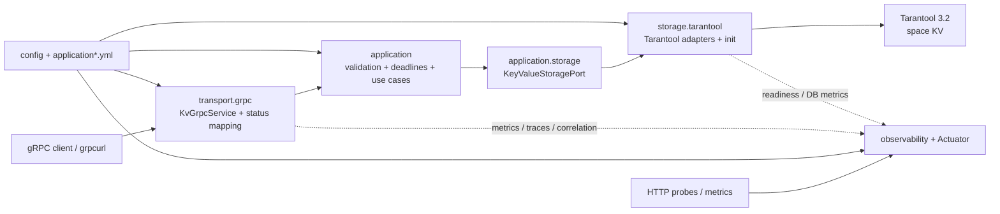

# Architecture note

Этот документ нужен как короткая GitHub-facing схема текущего runtime-слоя репозитория. Он описывает реальные пакеты, порты и trade-off'ы v1/post-v1 и не требует чтения внутренних process-документов.

## Схема слоёв

## Реальные package boundaries

- `io.kvservice.transport.grpc` принимает protobuf request/response, создаёт request budget, ограничивает число активных `range`-stream и централизованно переводит внутренние ошибки в gRPC status.
- `io.kvservice.application` содержит transport-neutral use cases, валидацию ключей/значений, deadline/cancellation discipline и правила для `Put/Get/Delete/Range/Count`.
- `io.kvservice.application.storage` задаёт storage port и внутренние модели (`StoredEntry`, `StoredValue`, `RangeBatchQuery`) без знания о gRPC.
- `io.kvservice.storage.tarantool` реализует `KeyValueStoragePort`, tuple mapping, batched range scan, exact `count()` и idempotent init `space KV`.
- `io.kvservice.config` связывает properties, gRPC server customizers, Tarantool client wiring и observability beans.
- `io.kvservice.observability` отвечает за structured logging, correlation/trace fields, gRPC metrics/interceptors и readiness health indicator для Tarantool.
- `io.kvservice.api.v1` содержит generated protobuf messages и gRPC stubs из [`src/main/proto/kv/v1/kv_service.proto`](../src/main/proto/kv/v1/kv_service.proto).

## Публичные surface и defaults

- gRPC listener по умолчанию: `127.0.0.1:9090` (`KV_GRPC_PORT`).
- HTTP/Actuator listener по умолчанию: `127.0.0.1:8080` (`KV_HTTP_PORT`).
- При отдельном `MANAGEMENT_SERVER_PORT` Actuator endpoints переезжают на management listener, а основной HTTP listener продолжает отдавать `/livez` и `/readyz`.
- Tracing starter включён в runtime stack, но внешний export остаётся опциональным: `MANAGEMENT_TRACING_EXPORT_ENABLED=false` отключает tracing auto-configuration без потери базовых logs/metrics.

## Ключевые trade-off'ы

- `Count` остаётся exact operation через storage layer и потому документируется как потенциально более дорогой RPC, чем обычные unary CRUD-вызовы.
- `Range` остаётся server-streaming RPC с внутренним batch scan и guardrail `range.max-active-streams=16`; это ограничивает память и concurrent pressure, но не обещает snapshot-consistent диапазон.
- Production-oriented default для `KV` space: `vinyl`. Это не делает `memtx` запрещённым для local/dev, но публичный runtime baseline проекта строится вокруг `vinyl`.
- Репозиторий документирует вызовы через `.proto` path и не требует server reflection как обязательной runtime фичи.

## Где смотреть детали

- [`README.md`](../README.md) — запуск, конфигурация, management/tracing knobs и quality gate.
- [`docs/grpcurl-examples.md`](./grpcurl-examples.md) — runnable `grpcurl` примеры для всех пяти RPC.
- [`docs/performance-note.md`](./performance-note.md) — perf/heavy-scale workflow, caveats и текущий verdict по runtime defaults.
